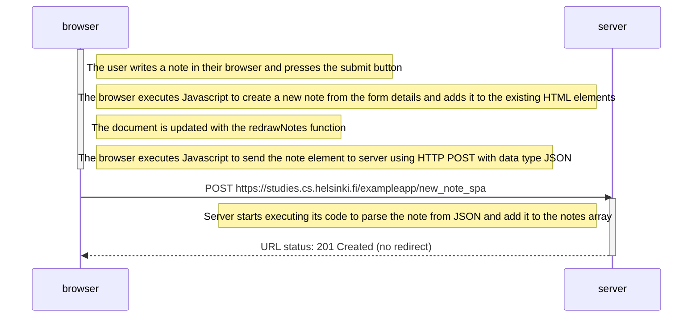

```mermaid
sequenceDiagram
    participant browser
    participant server

    activate browser
    Note right of browser: The user writes a note in their browser and presses the submit button
    Note right of browser: The browser executes Javascript to create a new note from the form details and adds it to the existing HTML elements
    Note right of browser: The document is updated with the redrawNotes function
    Note right of browser: The browser executes Javascript to send the note element to server using HTTP POST with data type JSON
    deactivate browser

    browser->>server: POST https://studies.cs.helsinki.fi/exampleapp/new_note_spa
    activate server
    Note left of server: Server starts executing its code to parse the note from JSON and add it to the notes array
    server-->>browser: URL status: 201 Created (no redirect)
    deactivate server
```
